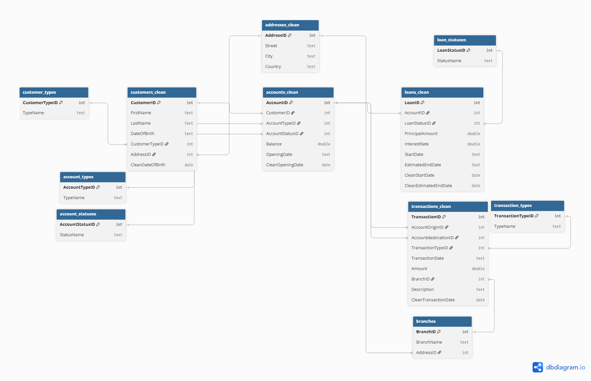

# Which customers show signs of financial risk, what behaviours distinguish them, and where should the bank prioritise monitoring?
> *One sentence. What did you analyze, build, or solve - and why does it matter?*

---

## ⚙️ Project Type Flags
> *Check what applies. This helps reviewers and collaborators understand the nature of the work at a glance. Delete this block before publishing.*

- [x] Exploratory Data Analysis (EDA)
- [x] SQL Analysis / Querying
- [x] Dashboard / Data Visualization
- [ ] Data Pipeline / ETL
- [ ] Predictive Modelling / Machine Learning
- [x] Data Cleaning / Wrangling
- [x] End-to-End (multiple of the above)
- [ ] Other: ___________

---

## Table of Contents
1. [Project Overview](#1-project-overview)
2. [Objectives](#2-objectives)
3. [Project Scope & Tools](#3-project-scope--tools)
4. [Repository Structure](#4-repository-structure)
5. [Data Workflow](#5-data-workflow)
6. [Data Model & Schema](#6-data-model--schema)
7. [ERD - Entity Relationship Diagram](#7-erd--entity-relationship-diagram) *(SQL projects)*
8. [Analysis & Metrics](#8-analysis--metrics)
9. [Key Insights](#9-key-insights)
10. [Recommendations](#10-recommendations)
11. [Assumptions & Limitations](#11-assumptions--limitations)
12. [Future Enhancements](#12-future-enhancements)
13. [Deliverables](#13-deliverables)
14. [Author](#14-author)

---

## 1. Project Overview

Banks hold large amounts of customer information across accounts, loans and transactions, but individual warning signs may not provide enough context to determine which customers require closer monitoring. This project was built around the business question: **Which customers show signs of financial risk, what behaviours distinguish them, and where should the bank prioritise monitoring?** Using MySQL, the dataset of 1,100 customers was cleansed and analysed, then explored to investigate account balances, loan exposure, overdue borrowing and unusual transaction behaviour to understand how these indicators appeared individually and grouped. It was found that no single behaviour repeatedly identified customers as a concern; however, combining more indicators into a rule-based monitoring framework identified **5 Higher Priority Customers**, several of whom showed substantial loan exposure relative to their account balances alongside other warning signs. The findings were presented in an interactive Power BI dashboard to help focus monitoring and further investigation on customers displaying multiple indicators.


## 2. Objectives
- **Primary Objective:** Identify customers displaying multiple financial risk indicators and develop a transparent framework for prioritising them for further monitoring.

- **Secondary Objective 1:** Determine which account, loan and transaction behaviours — including negative balances, overdue loans, high loan exposure and unusually large transactions — may indicate greater financial vulnerability.

- **Secondary Objective 2:** Evaluate how these indicators vary across customer types and whether additional factors, such as account status, provide useful information for customer monitoring.

---

## 3. Project Scope & Tools


| Dimension | Details |
|-----------|---------|
| **In Scope** | Customer, account, loan and transaction data. Analysis covers account balances, loan exposure, overdue loans, transaction behaviour and customer monitoring priority. |
| **Out of Scope** | Predictive risk modelling, forecasting future customer behaviour and estimating financial losses. The project uses a rule-based monitoring framework and the dataset does not provide confirmed financial loss outcomes. |
| **Time Period** | Transaction Data ranges from 2020-2025; however, monthly transaction trend analysis is limited to 2020-2023 because transaction records are incomplete after February 2024. Customer and loan analysis used all valid available records.|
| **Granularity** | Individual transactions, loans and accounts, summarised by customer and branch. |

### Tools & Technologies

| Category | Tool(s) Used |
|----------|-------------|
| Data Storage |  CSV files |
| Data Processing | SQL |
| Analysis | custom SQL queries |
| Visualization |  Power BI |
| Version Control | GitHub |
| Documentation |  Markdown |


---

## 4. Repository Structure

```
[project-root]/
│
├── data/
│   ├── raw/                  # Original source CSV files
│   └── processed/            # Cleaned and transformed CSV files
│   
│
│
│
├── queries/  
│   ├── exploratory/          # Ad-hoc or investigative queries
│   ├── transformations/      # Data quality/cleaning
│   └── final/                SQL views used for Power BI
│
│
├── visuals/                  # Dashboard screenshots and ERD diagrams
│
│
└── README.md                 # Project documentation
```


---

## 5. Data Workflow

1. **Source:** This project used a finance dataset from Kaggle containing 10 CSV files covering customers, accounts, loans, transactions, addresses, branches and supporting lookup tables. The main analytical tables included 1,111 customer records, 1667 account records, 333 loan records and 12,319 transaction records.
2. **Ingestion:** The CSV files were imported into MySQL; the original tables were kept as raw data, while separate tables were made for the tables requiring data corrections.
3. **Cleaning:** Each table was assessed for duplicate records, missing values, inconsistent date formats, invalid values and relationship integrity. Removed exact duplicates, reducing customers from 1,111 to 1,100, accounts from 1,667 to 1,651, loans from 333 to 330 and transactions from 12,319 to 12,296. Blank values were standardised to NULL, mixed data formats were converted into consistent Date fields and unresolved or invalid dates were retained as NULL rather than inferred. Negative account balances were kept as they represented plausible financial behaviour rather than data errors.
4. **Transformation:** Cleaned customer, account, loan and transaction data were joined and aggregated to the customer level. Created metrics for total account balance, loan exposure, overdue loan exposure, transaction frequency, and value. In addition, four monitoring indicators were derived: negative account, overdue loan presence, loan exposure exceeding positive account balances and a largest outgoing transaction at least twice a customer's average outgoing transaction.
5. **Analysis:** SQL was used to compare customer types, investigate account balances and transaction behaviour, assess loan exposure and identify overdue loans. Plus, the analysis resulted in a combination of financial risk indicators, the four indicators were joined into a rule based monitoring score ranking customers with scores of 0-1 as Lower Priority, 2 as Moderate Priority, and 3-4 as Higher Priority. This formula is intended to prioritise customers for further review  rather than making a prediction.
6. **Output:** Four SQL views were created as a reporting layer for Power BI: a customer risk profile, monthly transaction trends, loan status summary and branch risk-activity summary. These views feed a two-page Power BI report consisting of a high-level Risk Overview and a Risk Investigation page for examining individual customers and branch-level activity.

---

## 6. Data Model & Schema

### Dataset / Table: `Customers_clean`

| Field Name | Data Type | Description | Example Value |
|------------|-----------|-------------|---------------|
|`CustomerID` | INT | Unique identifier for each customer | 10000 |
| `FirstName` | VARCHAR | Customer's first name | Maybell |
| `LastName` | VARCHAR | Customer's last name | Acevedo |
| `DateOfBirth` | VARCHAR | Original date of birth from the source data | 1979-12-27 00:00:00 |
| `CustomerTypeID` | INT | Identifies the customer's type | 2 |
| `AddressID` | INT | Links the customer to their address | 1021 |
| `CleanDateOfBirth` | DATE | Standardised date of birth used for analysis | 1979-12-27 |

> **Row count (approx.):** 1,100
> **Key join / relationship:**  `CustomerTypeID` → `customer_types.CustomerTypeID`; `AddressID` → `addresses_clean.AddressID`


### Dataset / Table: `accounts_clean`

| Field Name | Data Type | Description | Example Value |
|------------|-----------|-------------|---------------|
| `AccountID` | INT | Unique identifier for each account | 200000 |
| `CustomerID` | INT | Identifies the customer who owns the account | 10330 |
| `AccountTypeID` | INT | Identifies the type of account | 2 |
| `AccountStatusID` | INT | Identifies the current status of the account | 1 |
| `Balance` | DECIMAL | Account balance | 35794.37 |
| `OpeningDate` | VARCHAR | Original account opening date | 2018-04-06 00:00:00 |
| `CleanOpeningDate` | DATE | Standardised account opening date used for analysis | 2018-04-06 |

> **Row count (approx.):** 1,651
> **Account opening date range:** 2018-01-03 – 2026-07-06 
> **Key join/relationship:** `CustomerID` → `customers_clean.CustomerID`; `AccountTypeID` → `account_types.AccountTypeID`


### Dataset / Table: `loans_clean`

| Field Name | Data Type | Description | Example Value |
|------------|-----------|-------------|---------------|
| `LoanID` | INT | Unique identifier for each loan | 400000 |
| `AccountID` | INT | Identifies the account associated with the loan | 201241 |
| `LoanStatusID` | INT | Identifies the current loan status | 3 |
| `PrincipalAmount` | DECIMAL | Original principal amount of the loan | 52255.85 |
| `InterestRate` | DECIMAL | Interest rate associated with the loan | 0.1283 |
| `StartDate` | VARCHAR | Original loan start date | 2021-04-05 00:00:00 |
| `EstimatedEndDate` | VARCHAR | Original estimated loan end date | 2022-08-16 00:00:00 |
| `CleanStartDate` | DATE | Standardised loan start date | 2021-04-05 |
| `CleanEstimatedEndDate` | DATE | Standardised estimated loan end date | 2022-08-16 |


> **Row count (approx.):** 330
> **Loan start date range:** 2021-01-01 – 2026-08-29  
> **Key join/relationship:** `AccountID` → `accounts_clean.AccountID`; `LoanStatusID` → `loan_statuses.LoanStatusID`

### Dataset / Table: `transactions_clean`

| Field Name | Data Type | Description | Example Value |
|------------|-----------|-------------|---------------|
| `TransactionID` | BIGINT | Unique identifier for each transaction | 3000001 |
| `AccountOriginID` | BIGINT | Account from which the transaction originated | 201103 |
| `AccountdestinationID` | BIGINT | Account receiving the transaction | 200262 |
| `TransactionTypeID` | BIGINT | Identifies the type of transaction | 3 |
| `TransactionDate` | VARCHAR | Original transaction date and time | 2023-05-12 02:00:00 |
| `Amount` | DECIMAL | Value of the transaction | 4713.48 |
| `BranchID` | BIGINT | Identifies the branch associated with the transaction | 23 |
| `Description` | VARCHAR | Transaction description | Transaction 1 |
| `CleanTransactionDate` | DATE | Standardised transaction date used for analysis | 2023-05-12 |

> **Row count (approx.):** 12,296
> **Date range:** 2020-01-01 – 2026-08-28 
> **Key join/relationship:** `AccountOriginID` and `AccountdestinationID` → `accounts_clean.AccountID`; `TransactionTypeID` → `transaction_types.TransactionTypeID`; `BranchID` → `branches.BranchID`


### Dataset / Table: `addresses_clean`

| Field Name | Data Type | Description | Example Value |
|------------|-----------|-------------|---------------|
| `AddressID` | INT | Unique identifier for each address | 1 |
| `Street` | VARCHAR | Street associated with the address | Van Ness |
| `City` | VARCHAR | City associated with the address | Vineland |
| `Country` | VARCHAR | Country associated with the address | United States |

> **Row count (approx.):** 1210
> **Key join/relationship:**  `AddressID` is referenced by customer and branch records.

### Dataset / Table: `branches`

| Field Name | Data Type | Description | Example Value |
|------------|-----------|-------------|---------------|
| `BranchID` | INT | Unique identifier for each branch | 1 |
| `BranchName` | VARCHAR | Name of the branch | Branch 1 |
| `AddressID` | INT | Links the branch to its address | 733 |

> **Row count:** 50  
> **Key relationship:** `AddressID` → `addresses_clean.AddressID`

### Lookup Table: `customer_types`

Maps each `CustomerTypeID` to a customer category:

| CustomerTypeID | TypeName |
|---:|---|
| 1 | Individual |
| 2 | Small Business |
| 3 | Large Enterprise |

> **Row count:** 3  
> **Key relationship:** `CustomerTypeID` → `customers_clean.CustomerTypeID`

### Lookup Table: `transaction_types`

Maps each transaction to its transaction type.

| TransactionTypeID | TypeName |
|---:|---|
| 1 | Deposit |
| 2 | Withdrawal |
| 3 | Transfer |
| 4 | Payment |

> **Row count:** 4  
> **Key relationship:** `transactions_clean.TransactionTypeID` → `transaction_types.TransactionTypeID`

### Lookup Table: `loan_statuses`

Reference table defining the possible status of a loan.

| LoanStatusID | StatusName |
|---:|---|
| 1 | Active |
| 2 | Paid Off |
| 3 | Overdue |

> **Row count:** 3  
> **Key relationship:** `loans_clean.LoanStatusID` → `loan_statuses.LoanStatusID`

### Lookup Table: `account_types`

Reference table defining the different types of customer accounts.

| AccountTypeID | TypeName |
|---:|---|
| 1 | Checking |
| 2 | Savings |
| 3 | Payroll |
| 4 | Business |
| 5 | Youth |

> **Row count:** 5  
> **Key relationship:** `accounts_clean.AccountTypeID` → `account_types.AccountTypeID`

### Lookup Table: `account_statuses`


| AccountStatusID | StatusName |
|---:|---|
| 1 | Active |
| 2 | Inactive |
| 3 | Closed |

> **Row count:** 3
> **Key relationship:** `accounts_clean.AccountStatusID` → `account_statuses.AccountStatusID`
---

## 7. ERD - Entity Relationship Diagram


*Eleven-table finance schema — customers, accounts, loans and transactions connected through shared IDs and supporting reference tables.*

---

**Table Relationships Summary:**

| Relationship | Join Key | Type |
|-------------|----------|------|
| `accounts_clean` → `customers_clean` | `CustomerID` | Many-to-One |
| `loans_clean` → `accounts_clean` | `AccountID` | Many-to-One |
| `transactions_clean` → `accounts_clean` | `AccountOriginID` → `AccountID` | Many-to-One |
| `transactions_clean` → `accounts_clean` | `AccountdestinationID` → `AccountID` | Many-to-One |
| `customers_clean` → `customer_types` | `CustomerTypeID` | Many-to-One |
| `accounts_clean` → `account_types` | `AccountTypeID` | Many-to-One |
| `accounts_clean` → `account_statuses` | `AccountStatusID` | Many-to-One |
| `loans_clean` → `loan_statuses` | `LoanStatusID` | Many-to-One |
| `transactions_clean` → `transaction_types` | `TransactionTypeID` | Many-to-One |
| `transactions_clean` → `branches` | `BranchID` | Many-to-One |
| `customers_clean` → `addresses_clean` | `AddressID` | Many-to-One |
| `branches` → `addresses_clean` | `AddressID` | Many-to-One |

Most relationships are many-to-one, with multiple customer, account, loan or transaction records linking to a single reference record.

---

## 8. Analysis & Metrics

### Analytical Approach
The analysis began by exploring whether individual financial behaviours could help identify customers who may require closer monitoring. Rather than assuming that one behaviour represented financial risk, I investigated several possible indicators separately before examining how they interacted.

The analysis followed a series of questions:

1. **Do account balances reveal signs of financial vulnerability?**  
   Customer balances were analysed to identify negative balances and determine whether these occurred more frequently within particular customer types.

2. **Does loan behaviour provide a stronger indication of financial pressure?**  
   Loan exposure, loan status and overdue exposure were examined to identify customers carrying substantial borrowing or overdue debt. Loan exposure was also compared with customer account balances to identify cases where borrowing exceeded available balances.

3. **Do transaction patterns reveal unusual customer behaviour?**  
   Incoming and outgoing transaction frequency and value were analysed alongside net transaction flow. Large outgoing transactions were assessed relative to each customer's own average transaction value rather than using a single fixed threshold across all customers.

4. **Do multiple indicators occur together?**  
   Individual indicators were compared to determine whether customers displaying one warning sign also displayed others. For example, negative balances were compared with overdue loans; no customers displayed both indicators at the same time. This supported using several indicators rather than relying on a single measure.

5. **Can these behaviours be combined into a practical monitoring framework?**  
   Four indicators — negative balances, overdue loans, high loan exposure and unusually large outgoing transactions — were combined into a rule-based Risk Score. Customers triggering more indicators were assigned a higher monitoring priority, allowing the analysis to narrow 1,100 customers to a small group requiring further review.

6. **Are there other characteristics associated with monitoring priority?**  
   Additional exploratory analysis tested whether account status was associated with the final monitoring categories. Among the five Higher Priority customers, four had active accounts and one had an inactive account, while none had closed accounts. As no clear pattern emerged and the Higher Priority group was small, account status was not added to the Risk Score or dashboard.

7. **Where is Higher Priority customer activity occurring?**  
   Transaction activity from Higher Priority customers was aggregated by branch to identify where this activity was concentrated. This was used as a monitoring and investigation measure rather than an assessment of branch risk or financial loss.

### Key Metrics Defined

| Metric | Plain-Language Definition | Why It Matters |
|--------|---------------------------|----------------|
| **Total Balance** | Combined balance across all accounts held by a customer. | Provides an overall view of the customer's available account balance. |
| **Total Loan Exposure** | Total principal value of loans associated with a customer's accounts. | Shows the level of lending exposure associated with each customer. |
| **Overdue Loan Exposure** | Total principal value of a customer's loans currently classified as overdue. | Identifies customers with outstanding overdue loan exposure requiring closer attention. |
| **Net Transaction Flow** | Total incoming transaction value minus total outgoing transaction value for each customer. | Helps identify whether transaction activity is producing an overall inflow or outflow of funds. |
| **Risk Score** | Number of monitoring indicators triggered by a customer, producing a score from 0 to 4. | Combines multiple financial behaviours into a simple method for prioritising customer review. |
| **Monitoring Priority** | Customers are grouped as Lower (0–1), Moderate (2), or Higher Priority (3–4) based on their Risk Score. | Allows monitoring efforts to focus on customers displaying multiple risk indicators. |

#### Risk Score Indicators

Each customer receives one point for each of the following conditions:

- **Negative Balance:** At least one account has a balance below zero.
- **Overdue Loan:** At least one associated loan is classified as overdue.
- **High Loan Exposure:** Total loan exposure exceeds the customer's total positive account balance.
- **Large Transaction:** The customer's largest outgoing transaction is at least twice their average outgoing transaction value.

**Risk Score:** 0–4

- **0–1:** Lower Priority
- **2:** Moderate Priority
- **3–4:** Higher Priority
- 
### Methods Used
- Data quality assessment and validation before analysis.
- Descriptive analysis of account balances, loans and transaction behaviour.
- Customer segmentation and comparison by customer type.
- Loan exposure and overdue loan analysis.
- Monthly transaction trend analysis.
- Customer-level aggregation across accounts, loans and transactions.
- SQL window functions for ranking and month-over-month comparisons.
- Rule-based scoring to combine multiple financial risk indicators.
- Branch-level analysis of transaction activity associated with Higher Priority customers.

---

## 9. Key Insights
**Insight 1: Financial vulnerability appeared through different behaviours rather than one universal warning sign**  
The analysis found 
**10** customers with negative account balances and **34** overdue loans representing 1.67M in principal exposure, but no customer appeared in both groups. Negative balances were also uncommon across all customer types: 1.51% of Large Enterprise customers had a negative balance compared with 0.57% of both Individual and Small Business customers. Overdue loans showed a similar but modest difference, affecting 3.53% of Large Enterprise customers, 2.85% of Individuals and 2.27% of Small Businesses. These results suggest that financial vulnerability was not represented by one consistent behaviour or customer segment, supporting the use of multiple indicators when deciding who requires closer monitoring.

**Insight 2: Overdue lending represented a smaller but important portion of overall loan exposure**  
Of the 330 cleaned loan records, 239 were Active, 57 were Paid Off and 34 were Overdue. Active loans represented 12.41M of principal exposure, compared with 3.00M in Paid Off loans and 1.67M in Overdue loans. Although overdue exposure represented a relatively small share of total loan exposure, its importance becomes clearer at customer level because some customers carried overdue borrowing alongside other indicators of financial pressure. This made overdue status more useful when considered together with a customer's overall loan exposure and account position rather than as an isolated count of overdue loans.

**Insight 3: Comparing loan exposure with account balances revealed customers whose borrowing was large relative to their financial position**  
Looking only at loan values did not show whether the exposure was substantial relative to the funds held by each customer. The analysis therefore compared total loan exposure with total positive account balances and used loan exposure exceeding balance as an additional monitoring indicator. This relationship was particularly visible among the Higher Priority group: Cristobal Lowery held 141,014.24 in loan exposure against a balance of 37,540.05; Jae Bowman held 79,096.89 against 32,750.67; Laine Montgomery held 116,582.65 against 102,535.66; and Regena Atkinson held 104,062.33 against 23,432.34. All four also had overdue loan exposure, showing why the relationship between borrowing, balances and repayment status provided more context than loan value alone.

**Insight 4: Transaction monitoring was more meaningful when customer behaviour was compared with the customer's own baseline**  
Transaction analysis examined outgoing and incoming frequency and value, net transaction flow and customers' largest outgoing transactions. Rather than defining every transaction above a fixed amount as unusual, the analysis compared each customer's largest outgoing transaction with their own average outgoing transaction value. A transaction at least twice the customer's average was treated as a monitoring indicator. This approach accounts for differences in normal transaction behaviour between customers and allowed unusual activity to contribute to the overall monitoring framework without treating a large transaction alone as evidence of financial risk.

**Insight 5: Combining the indicators reduced 1,100 customers to five Higher Priority cases for focused review**  
The final framework combined four indicators — negative balances, overdue loans, loan exposure exceeding positive account balances and unusually large outgoing transactions — into a Risk Score from 0 to 4. Customers scoring 0–1 were classified as Lower Priority, 2 as Moderate Priority and 3–4 as Higher Priority. Only five customers reached Higher Priority, and each triggered three of the four indicators. This demonstrates the main value of the framework: rather than treating thousands of customers or individual warning signs equally, it identifies a small group where several concerning behaviours occur together and gives management a clearer starting point for further investigation.

Higher Priority customer transaction activity was then examined by branch to understand where this activity was occurring, with **Branch 6 recording the highest transaction value from Higher Priority customers**. This does not imply that Branch 6 caused the behaviour or experienced greater financial loss; it simply identifies where monitoring teams may encounter a greater concentration of transaction value associated with the customers already prioritised by the framework.

## 10. Recommendations

| Priority | Recommendation | Based On | Suggested Owner |
|----------|---------------|----------|-----------------|
| **High** | Prioritise the five Higher Priority customers for individual review, focusing on the specific combination of indicators each customer triggered rather than treating the Risk Score alone as evidence of financial risk. | **Insight 5** – Five of 1,100 customers triggered three of the four monitoring indicators. | Risk Monitoring / Customer Review Team |
| **High** | Introduce regular monitoring of customers whose loan exposure exceeds their positive account balances, with additional attention where overdue borrowing is also present. This would help surface customers whose borrowing appears high relative to the funds held in their accounts. | **Insights 2 & 3** – 1.67M of loan exposure was overdue, and four Higher Priority customers combined overdue exposure with loan exposure exceeding their account balances. | Credit Risk / Lending Team |
| **Medium** | Use multiple behavioural indicators when prioritising customer reviews instead of relying on negative balances, overdue loans or transaction activity independently. The rule-based framework can be used as an initial screening tool, with cases reviewed before any action is taken. | **Insights 1 & 5** – Individual warning signs identified different customers, while combining indicators produced a focused Higher Priority group. | Risk Monitoring Team |
| **Medium** | Review transaction activity associated with Higher Priority customers at Branch 6 and other branches with concentrated Higher Priority transaction value. The review should focus on the customers and transactions involved rather than treating branch-level activity as evidence that the branch itself is risky. | **Insight 6** – Branch 6 recorded the highest transaction value associated with Higher Priority customers. | Branch Operations / Risk Monitoring Team |

---

## 11. Assumptions & Limitations

<!--
  WHAT GOOD LOOKS LIKE:
  Assumption: "Transaction records were assumed to be complete for all five regions.
               No validation was performed against source system record counts."
  Limitation: "The analysis cannot distinguish between returns initiated by
               the customer vs. returns initiated by the business (e.g., recalls).
               If business-initiated returns are concentrated in Region A, the
               return rate finding may reflect a policy decision, not a quality issue."

  WHAT TO AVOID:
  ❌ Leaving this section blank or writing "None known."
     Every project has limitations. Documenting them is a sign of
     analytical maturity - not a confession of failure.
-->

### Assumptions
- [What did you treat as true without being able to verify?]
- [What simplifications did you make for scope or feasibility?]
- [What domain rules or definitions did you accept as given?]

### Limitations
- [What gaps exist in the data?]
- [What analysis was out of scope but could affect interpretation?]
- [What would a more rigorous version of this project include?]
- [Are there known biases in the data source or collection method?]

Account status analysis: Account status was explored as an additional monitoring factor. Among the five Higher Priority customers, four had active accounts and one had an inactive account; none had closed accounts. Given the small Higher Priority group and lack of a clear pattern, account status was not added to the risk score or final dashboard.
> *The goal here is pre-emptive Q&A. What would a thoughtful skeptic push back on? Document the answer here, before they ask.*

## 11. Assumptions & Limitations

The analysis was designed as an exploratory customer-monitoring framework rather than a predictive risk model. The following assumptions and limitations define how the findings should be interpreted.

### Assumptions

- **Selected behaviours were treated as monitoring indicators, not confirmed risk outcomes:** Negative account balances, overdue loans, loan exposure exceeding positive account balances and unusually large outgoing transactions were treated as behaviours that may justify closer review. The presence of any of these indicators does not by itself demonstrate that a customer is financially distressed or will generate a financial loss.

- **Negative balances were treated as valid financial behaviour:** Ten customers had negative account balances. These values were retained because a negative balance is financially plausible and there was no evidence in the dataset that the values were data-entry errors. This allowed negative balances to be explored as a potential vulnerability indicator rather than removing them during cleaning.

- **Principal amount was used as a proxy for loan exposure:** The dataset provides the original `PrincipalAmount` of each loan but does not provide the remaining outstanding balance. Total Loan Exposure and Overdue Loan Exposure therefore represent principal amounts associated with customers rather than confirmed amounts currently owed. This was considered sufficient for comparing relative exposure within the dataset, but it should not be interpreted as the bank's exact current credit exposure.

- **Loan exposure was evaluated relative to positive account balances:** High Loan Exposure was defined as total loan exposure exceeding a customer's total positive account balance. This was intended to provide more context than ranking customers by loan size alone. Account balances, however, represent only the funds visible in this dataset and should not be interpreted as a complete measure of a customer's wealth, income, liquidity or ability to repay.

- **Unusually large transactions were defined relative to each customer's own activity:** A customer's largest outgoing transaction was flagged when it was at least twice their average outgoing transaction value. A customer-specific baseline was used because normal transaction sizes differ between customers. The 2× threshold is an exploratory rule developed for this project and is not presented as an established banking or regulatory threshold.

- **Loan status categories were accepted as provided:** Loans labelled Active, Paid Off or Overdue were assumed to accurately represent their status in the source data. The dataset does not provide additional information such as number of days overdue, missed payment history or repayment schedules that would allow the severity of overdue borrowing to be independently assessed.

### Limitations

- **The Risk Score is rule-based and has not been statistically validated:** The four indicators each contribute one point, meaning they are given equal importance in the final score. There is no confirmed outcome variable in the dataset that could be used to test whether one indicator is more strongly associated with future financial loss than another. The 0–1 Lower, 2 Moderate and 3–4 Higher Priority thresholds should therefore be interpreted as a transparent prioritisation framework rather than validated risk classifications.

- **Individual indicators identified different types of financial behaviour:** The analysis found 10 customers with negative balances and 34 overdue loans representing 1.67M in principal exposure, but no customer appeared in both groups. This demonstrates why one indicator should not be interpreted as a complete measure of customer risk. It also means that the final monitoring framework depends on the selected combination of indicators and could produce different classifications if alternative indicators or thresholds were used.

- **The Higher Priority population is very small:** Only five of the 1,100 customers were classified as Higher Priority, with each triggering three of the four monitoring indicators. These customers provide useful cases for focused review, but patterns within a group of five should not be generalised to the wider customer population. A larger dataset or additional periods of customer history would be required to determine whether the same combinations of indicators repeatedly identify customers requiring greater attention.

- **Customer-type differences should be interpreted cautiously:** Large Enterprise customers had the highest observed negative-balance rate at 1.51%, compared with 0.57% for both Individuals and Small Businesses, and the highest proportion of customers with overdue loans at 3.53%, compared with 2.85% for Individuals and 2.27% for Small Businesses. These differences were descriptive and were not statistically tested. They therefore provide context for monitoring but are not sufficient evidence that Large Enterprise customers are inherently more financially risky.

- **Account status did not provide a clear additional monitoring signal:** Account status was explored after the initial monitoring framework was developed to determine whether Active, Inactive or Closed accounts were associated with monitoring priority. Among the five Higher Priority customers, four had Active accounts and one had an Inactive account; none had Closed accounts. Given the small Higher Priority population and absence of a clear pattern, account status was not incorporated into the Risk Score or final dashboard. This was treated as a useful exploratory non-finding rather than forcing an additional variable into the framework.

- **Transaction history is incomplete across the full available period:** Clean transaction records span 2020-01-01 to 2026-08-28, but records become incomplete and sparse after February 2024. Monthly transaction trend analysis was therefore restricted to 2020–2023. Trends observed during this complete period should not automatically be assumed to continue into later years.

- **The transaction indicator captures relative size, not the reason for the transaction:** The analysis examined outgoing and incoming transaction frequency and value, net transaction flow and unusually large outgoing transactions. However, the dataset does not provide enough contextual information to determine why a transaction occurred or whether an unusually large transaction was expected. The Large Transaction Indicator therefore identifies behaviour that differs from a customer's typical transaction size but does not establish that the transaction itself is problematic.

- **Account balances provide only a snapshot of the information available in the dataset:** Comparing loan exposure with account balances helped identify customers whose borrowing was high relative to funds held in their accounts, particularly among several Higher Priority customers. However, the analysis does not include customer income, external assets, liabilities held elsewhere, credit history or other information that a bank would normally use when assessing a customer's financial position.

- **Branch results measure where Higher Priority customer activity occurred, not branch performance or risk:** Branch 6 recorded the highest transaction value associated with Higher Priority customers. This does not demonstrate that Branch 6 caused the behaviour, has weaker controls or experienced greater financial loss. Branch was attached to transaction activity, while loans were associated with customer accounts, so the branch analysis should only be interpreted as showing where transaction value from already-prioritised customers was concentrated.

- **No confirmed financial loss outcome is available:** The dataset does not provide a validated outcome showing whether customers subsequently defaulted, generated a loss or otherwise experienced a confirmed adverse financial event. The project can therefore identify customers displaying combinations of behaviours that may justify closer monitoring, but it cannot establish that Higher Priority customers will cause future losses.

- **The analysis is descriptive rather than causal:** Relationships observed between balances, borrowing, overdue status, transaction behaviour, customer type and monitoring priority show patterns within this dataset. They do not establish that one behaviour caused another. For example, high loan exposure relative to account balance may warrant closer review, but the analysis cannot conclude that it causes overdue borrowing or financial difficulty.

---

## 12. Future Enhancements

<!--
  WHAT GOOD LOOKS LIKE:
  ✅ "Automate the monthly data pull from the POS export folder using
      a scheduled Python script, replacing the current manual process."
  ✅ "Expand the return rate analysis to include carrier-level data,
      which was unavailable in this dataset but exists in the logistics system."

  WHAT TO AVOID:
  ❌ "Add a machine learning model."
     (Vague, and disconnected from the actual findings of this project.)
  ❌ Listing aspirational features that don't follow logically from the work.
-->

- [ ] [Enhancement 1 - specific and traceable to a real gap in this project]
- [ ] [Enhancement 2]
- [ ] [Enhancement 3]
- [ ] [Enhancement 4]

---

## 13. Deliverables

| Deliverable | Description | Location |
|-------------|-------------|----------|
| [Name] | [What it contains] | [`/path/to/file`] |
| [Name] | [What it contains] | [`/path/to/file`] |
| [Name] | [What it contains] | [`/path/to/file`] |

---

## 14. Author

**Mishaella Osei**
Data Analyst

- 🔗 [LinkedIn URL]
- 💼 [Portfolio or GitHub profile URL]
- 📧 [Email - Oseimishaella385@gmail.com]

---

*Last updated: [Month YYYY]*
*If this template helped you, consider starring the repository.*
